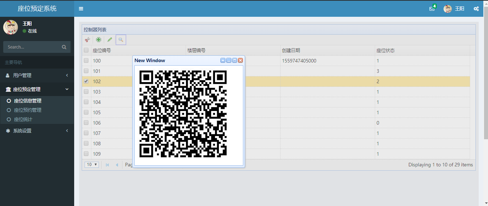

# 关于
本来准备是做一个图书馆占座的系统，由于当时的时间和知识不足只是实现了部分
功能。

# 运行方法
* 将项目克隆到你的本地
 git clone https://github.com/wangyang1749/library.git
* cd library-parent
* mvn jetty:run
* 输入http://localhost:8080/admin浏览项目

# 期望
* 继续实现相应功能
* 更好的集成quartz
* 改造为spring boot项目
* 更换UI，使用vue
